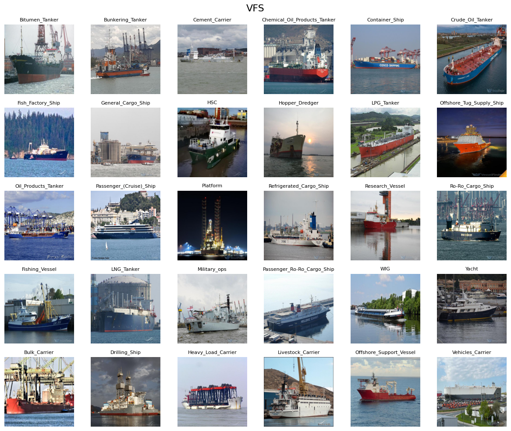

# Dataset for WORM: Working and Long-Term Prompt for Few-Shot Ship Classification

This repository hosts a dataset used in our paper, **"WORM: Working and Long-Term Prompt for Few-Shot Ship Classification"**. The dataset will be made publicly available **upon the acceptance of the paper**. Please note that this dataset is intended **for academic research purposes only**.

## Description

VFS, a comprehensive, large-scale dataset with 18,000 diverse real-world images across 30 vessel categories, each category contains 600 images.
A key advantage of VFS is its diverse external conditions, covering multiple viewpoints, weather, and lighting scenarios. This diversity helps mitigate model overfitting and enhances generalization.
Moreover, VFS cover a wide range of complex scenarios, with vessels appearing against challenging backgrounds like docks, offshore structures, and port facilities.
To further boost research value, VFS includes rich metadata, such as the IMO number, MMSI, vessel length, beam width, and year of build, making it an ideal benchmark for vessel recognition research.
### Dataset partition

#### Train (18)
- Bitumen_Tanker
- Bunkering_Tanker
- Cement_Carrier
- Chemical_Oil_Products_Tanker
- Container_Ship
- Crude_Oil_Tanker
- Fish_Factory_Ship
- General_Cargo_Ship
- Hopper_Dredger
- HSC
- LPG_Tanker
- Offshore_Tug_Supply_Ship
- Oil_Products_Tanker
- Passenger_(Cruise)_Ship
- Platform
- Refrigerated_Cargo_Ship
- Research_Vessel
- Ro-Ro_Cargo_Ship

#### Val (6)
- Bulk_Carrier
- Drilling_Ship
- Heavy_Load_Carrier
- Livestock_Carrier
- Offshore_Support_Vessel
- Vehicles_Carrier

#### Test (6)
- Fishing_Vessel
- LNG_Tanker
- Military_ops
- Passenger_Ro-Ro_Cargo_Ship
- WIG
- Yacht

## Meta Data
| imo     | callsign | mmsi     | vessel_name   | ship_type | flag           | year_of_build | length | beam |
| ------- | -------- | -------- | ------------- | --------- | -------------- | ------------- | ------ | ---- |
| 1000019 |          |          | LADY K II     | Yacht     | Panama         | 1961          | 57.6   | 8.8  |
| 1000021 | ZCCB8    | 3.2E+08  | MONTKAJ       | Yacht     | Cayman Islands | 1995          | 78     | 13   |
| 1000045 |          |          | OKTANA        | Yacht     | Greece         | 1995          | 38.5   | 7.48 |
| 1000069 | MRPW2    | 2.33E+08 | LADY BEATRICE | Yacht     | Isle of Man    | 1993          | 60     | 10   |

## Terms of Use

By accessing or using this dataset, you agree to the following terms:

1. **Academic Use Only**: This dataset is strictly for academic research purposes. Commercial use is prohibited.

