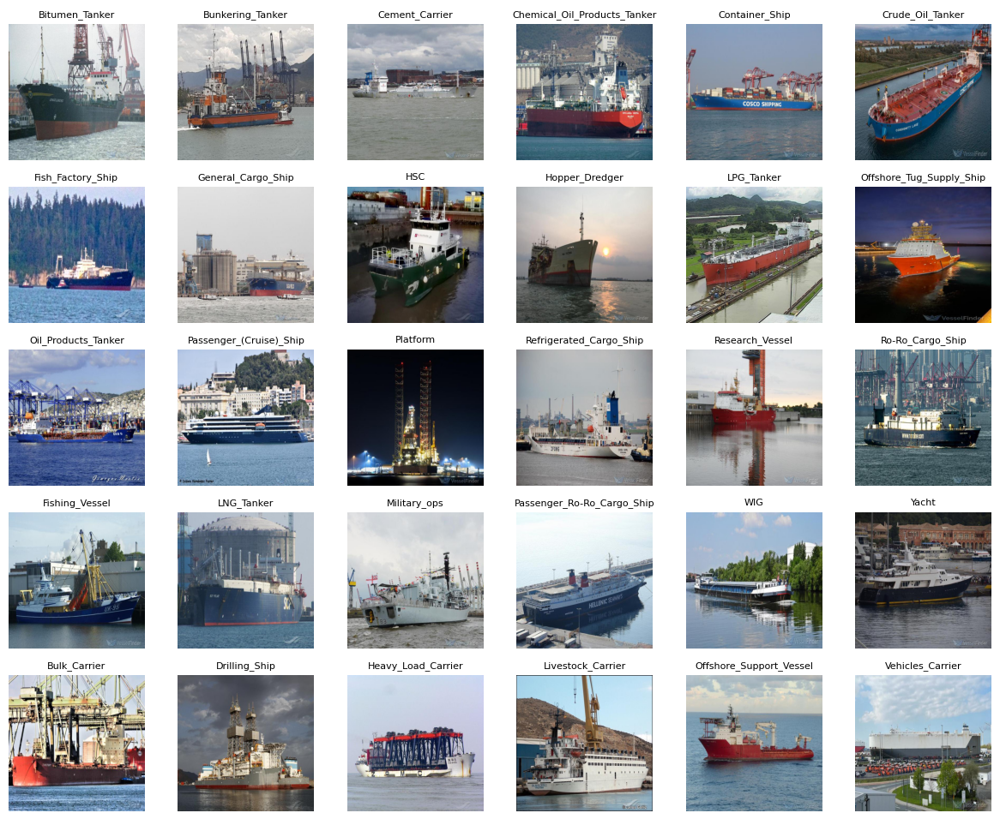

# Dataset for Dual-Prompting and Class-Aware Token Selection for UAV-Based Few-Shot Ship Classification

This repository hosts a dataset used in our paper, **"Dual-Prompting and Class-Aware Token Selection for UAV-Based Few-Shot Ship Classification"**. The dataset will be made publicly available **upon the acceptance of the paper**. Please note that this dataset is intended **for academic research purposes only**.

## **Data Collection**  

Vessel images were collected from public platforms such as Vesselfinder, captured via UAVs or from elevated viewpoints. After deduplication and removal of categories with fewer than 600 samples, 600 images were randomly selected for each of the remaining 30 categories, resulting in a balanced dataset of 18,000 images.

## **Vessel Characteristics**  

The 30 vessel classes are grouped into six superclasses according to their characteristic features (as shown in Table \ref{tab:types}).  

- **Tankers** feature deck-mounted liquid tanks and pipelines extending from bow to stern.  
- **Cargo vessels** have wide hulls and large cargo holds.  
- **Special vessels** are equipped with cranes or drilling towers.  
- **Fishing vessels** are small and fitted with fishing gear.  
- **Passenger vessels** have streamlined hulls with multi-deck superstructures.  
- **Military vessels** possess sharp hulls and decks with sensors and weapons.

## **Comparison with Existing Datasets**  

VCD surpasses existing maritime vessel datasets in both scale and granularity. It comprises 30 categories, compared to 6 in SeaShips, 9 in FSCD, and 15 in VAIS, with 600 high-quality images per class to ensure substantial intra-class variation. The dataset also captures diverse UAV viewpoints, lighting conditions, weather, and image resolutions (as shown in Figure \ref{fig:distr}), providing a comprehensive benchmark for evaluating model generalization in complex maritime environments. Moreover, VCD includes realistic and complex backgrounds, such as docks, offshore structures, and port facilities, further enhancing its suitability for training models robust to real-world scenarios and reducing overfitting.

## Dataset partition

Following standard practices in few-shot classification, the dataset is split into 18 training categories, 6 validation categories, and 6 test categories.

#### Train (18)

- Bitumen_Tanker
- Bunkering_Tanker
- Cement_Carrier
- Chemical_Oil_Products_Tanker
- Container_Ship
- Crude_Oil_Tanker
- Fish_Factory_Ship
- General_Cargo_Ship
- Hopper_Dredger
- HSC
- LPG_Tanker
- Offshore_Tug_Supply_Ship
- Oil_Products_Tanker
- Passenger_(Cruise)_Ship
- Platform
- Refrigerated_Cargo_Ship
- Research_Vessel
- Ro-Ro_Cargo_Ship

#### Val (6)

- Bulk_Carrier
- Drilling_Ship
- Heavy_Load_Carrier
- Livestock_Carrier
- Offshore_Support_Vessel
- Vehicles_Carrier

#### Test (6)

- Fishing_Vessel
- LNG_Tanker
- Military_ops
- Passenger_Ro-Ro_Cargo_Ship
- WIG
- Yacht

## Terms of Use

By accessing or using this dataset, you agree to the following terms:

1. **Academic Use Only**: This dataset is strictly for academic research purposes. Commercial use is prohibited.

